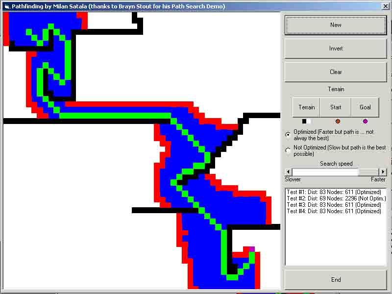



## \_Pathfinding\_

### Description

I am creating a strategy game and I have needed a good pathfinding so I've spent 3 hours to create this pathfinding tutorial. It has about 90 lines and it's quit simple but good. It isn't very fast but if you know how you can use it even in a real time game. Please leave comments and VOTE ...
 
### More Info
 

             |
---                |---
**Submitted On**   |2002-02-17 19:58:50
**By**             |[Milan Satala](https://github.com/Planet-Source-Code/PSCIndex/blob/master/ByAuthor/milan-satala.md)
**Level**          |Intermediate
**User Rating**    |4.8 (43 globes from 9 users)
**Compatibility**  |VB 6\.0
**Category**       |[Games](https://github.com/Planet-Source-Code/PSCIndex/blob/master/ByCategory/games__1-38.md)
**World**          |[Visual Basic](https://github.com/Planet-Source-Code/PSCIndex/blob/master/ByWorld/visual-basic.md)
**Archive File**   |[\_Pathfindi557542172002\.zip](https://github.com/Planet-Source-Code/milan-satala-pathfinding__1-31871/archive/master.zip)

